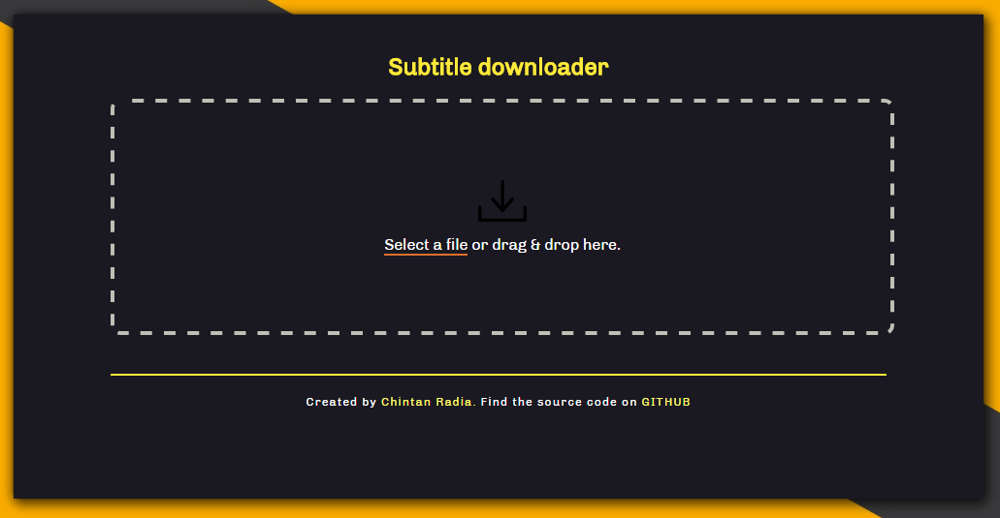

# Subtitle downloader

> A painless Subtitle downloader

 
[]

## Install

### Windows

[**Download**]() and unzip to some location and then open .exe file to run the application.

## Dev

Built with [Electron](http://electron.atom.io).

###### Commands

- Init: `$ npm install`
- Run: `$ npm start`
- Build Windows 32: `$ npm run build-windows32`
- Build Windows 34: `$ npm run build-windows34`

## License

MIT © [Chintan Radia](http://beatfreaker.github.io/)
